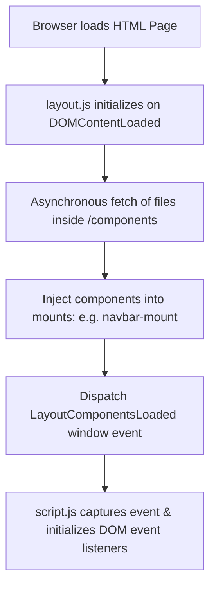

# Project Structure & Architecture Guide

A modular overview of the template's layout architecture.

---

## 📁 Directory Map

```text
├── index.html                  # Homepage (includes hero slider and reservation forms)
├── about.html                  # About Us/Legacy story page
├── menu.html                   # Interactive menu page with filters and product actions
├── packages.html               # Celebratory party packages details
├── testimonials.html           # Customer review highlights page
├── reserve.html                # Table reservation form page
├── cart.html                   # Sweet shopping cart page
├── likes.html                  # Liked items list page
├── gallery.html                # Filterable masonry visual gallery
│
├── config.js                   # Central business configuration (branding, SEO, contacts)
├── data.js                     # Editable product and menu dishes lists
├── layout.js                   # Asynchronous component loader and mount engine
├── translations.js             # English-Hindi translations dictionary
├── schema.js                   # Dynamic LocalBusiness Schema dynamic generator
├── script.js                   # Global interactive script handling dynamic features
│
├── components/                 # Reusable component layout blocks
│   ├── preloader.html          # Preloader monogram animation
│   ├── navbar.html             # Navigation header bar
│   ├── footer.html             # Newsletter and contacts footer
│   ├── box-builder.html        # Custom sweet box builder drawer
│   ├── mobile-actions.html     # Mobile sticky quick-actions bar (Call/WhatsApp/Directions)
│   └── whatsapp-widget.html    # Gourmet WhatsApp assistant popup
│
├── css/                        # Style sheets
│   ├── variables.css           # Central CSS design token variables
│   └── style.css               # Core styling rules (imports variables.css)
│
├── images/                     # Graphic and dish photo assets
├── robots.txt                  # Search engine crawl rules
└── sitemap.xml                 # Sitemap indexes template
```

---

## ⚙️ Layout Loading Lifecycle

The modular loader engine (`layout.js`) works as follows:



This ensures that the entire layout is highly modular while remaining a frontend-only static site.
